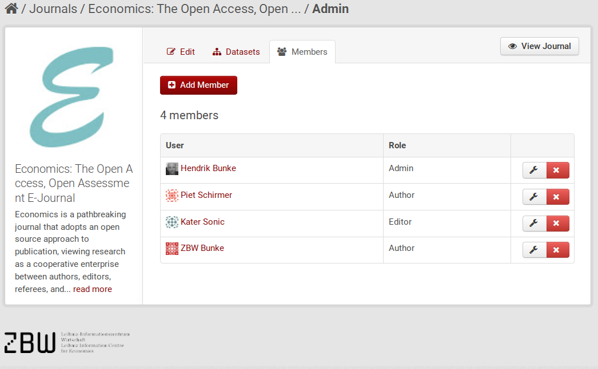
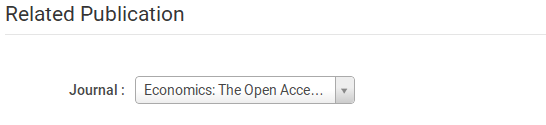
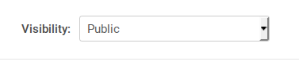

Workflow for submitting datasets to EDaWaX repository
=====================================================

Hendrik Bunke, 2015-08-03

Background
----------

CKAN's role model is quite basic. It has three roles for organizations (in our
case: a journal):

-   **Admin**: An admin can add, edit, and delete all datasets of the journal,
    as well as manage organization members.

-   **Editor**: Can add and edit all datasets, but not manage members.

-   **Member**: Can view the organization's private datasets, *but not add new datasets*.

Problematic for our usecase is that the member role is not allowed to add new
datasets. That would be demanded by our EDaWaX workflow model, which --for
now-- could be sketched like this:

-   an author adds an dataset to the journals repository, but cannot publish it
    (dataset is marked 'private'). *This is what CKANs role model does not allow*.

-   the journal admin reviews and edits the dataset, as well as assigns a DOI
    for dataset and ressources.

-   the journal admin publishs the dataset.

We could assign the 'Editor' role to authors, to give them rights to add
datasets. Unfortunately, this would also enable them to edit and *delete* all
the other datasets of the journal. So this would be a model based on trust
between the admin and the authors, and we cannot guarantee reliability.
Therefore we abandoned that option and rather choosed a software based
solution, overwriting some authentication functions of CKAN.

Technical Background
--------------------

The role model of CKAN is by default not modifyable. However, plugins can
introduce their own authentication methods. We use a CKAN extension originally
written for the data portal of the [Natural History Museum](http://data.nhm.ac.uk/),
called [`ckanext-userdatasets`](https://github.com/NaturalHistoryMuseum/ckanext-userdatasets),
which exactly fits our above sketched usecase workflow model.

The plugin does that by introducing new authentication function for the
relevant actions for datasets (create, edit, update), which then are calling
customized action functions. Esp. the latter is somehow a drawback and a
certain risk for future versions of CKAN and the EDaWaX repository, since we'll
might have to adapt all customized functions. We'll hopefully might have,
however, already a more sophisticated workflow and role management implemented
in CKAN core by then. So this solution should be considered a temporary
workaround.

In addition to ckanext-userdatasets we've implemented several customizations of
relevant templates (in ckanext-edawax-theme) and changed the title of the
member role to 'Authors'.

The Workflow in Detail
----------------------

The rights for the different roles are now implemented as follows:

**Anonymous**:

-   can only see datasets and lists of datasets that are published;

-   can not register;

-   can not upload.

**Authors**:

-   can not register (only journal admins can register!).

-   can upload and edit datasets for the journals they are registered for ONLY.

-   can see their own 'Private' dataset in the journal's list, but not other
    private ones.

**Editors**:

(no changes, see above)

**Admins**:

(no changes, see above)

#### Step-by-step

1.  **The journal admin adds a new author**

    The starting point of the workflow is the management page of the journal.
    The admin will basically just add the email address of the author, that
    should submit his dataset.

    ==> Going to <startpage journal>, click 'Manage' button ==> click
    'Members'.

    

    In that page (`/journals/members/journal_id`) the admin can see all members
    belonging to the journal including their role (Admin, Editor, Author). He
    will then

    ==> click 'Add Member'

    

    In 'New User' add the email address of the author. If the new author
    already has an edawax account, try to find her under 'Existing User'. The
    role 'Author' is selected by default.

    when finished:
    ==> click 'Add Member'

    The new author will be registered with an automatically created user id
    (based on email address). She will receive an email notification with the
    user name (which she can change herself later) and an URL to set her
    password.

    Admin will see the new user immediately in the members list.

2.  **User adds dataset to journal**

    After changing password and user id the user can add datasets, but only for
    the journal he has been registered for. That journal is preselected in the
    first dataset screen.

    

    In case the author has been connected to more than one journal it is important
    to select the correct one here.

    After adding the dataset it will be set private. The author can, however,
    edit it anytime, and also see it in the journal's dataset list.

3.  **Admin will review and edit dataset**

    <!-- TODO: will Admin get notification? -->

    The newly added dataset is listed in the journal's list of datasets. It
    is marked as 'Private' and can only be seen by Admins, Editors and the
    author. We have adapted this list slightly and also added the name of the
    dataset owner (e.g. the author).

    

    Admin will then edit the dataset and register a DOI.

4.  **Admin publishes dataset**
    If everything's done the admin (and ONLY the admin) can publish the
    dataset.

    **At the moment this can only be done by selecting 'Public' in the field
    'Visibility' in the first dataset edit screen**.  We are working on a
    better solution.

    
